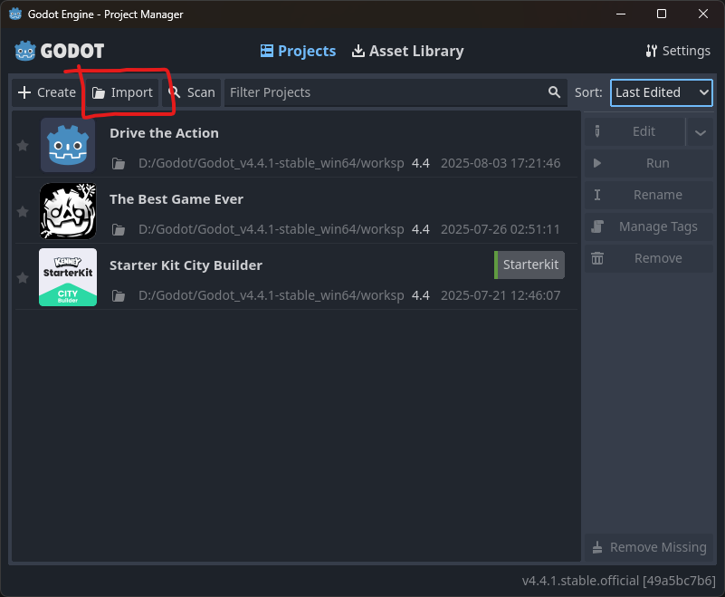
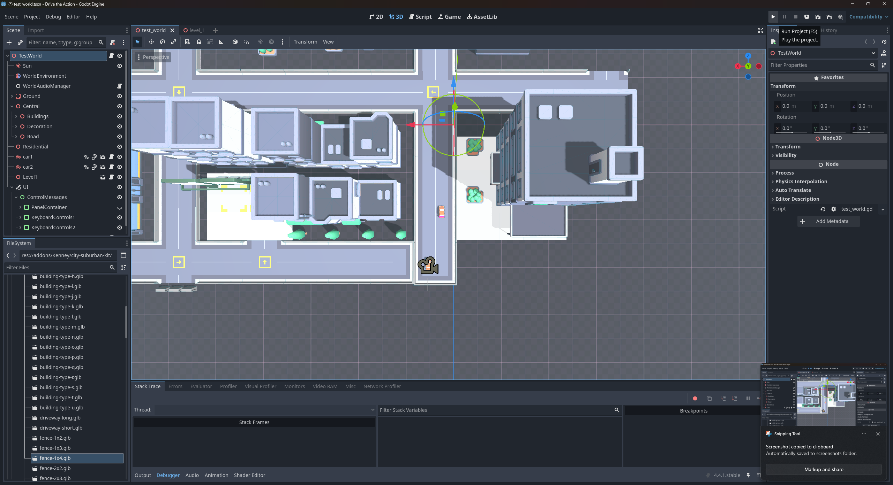

## Running the development build

Import the project into [Godot](https://godotengine.org/) - currently developed on v4.4.1. Cannot guarantee this will work for different versions

After the project is imported, you'll see the Godot editor. You should be fine to hit the Run Project button inthe top right of the window

